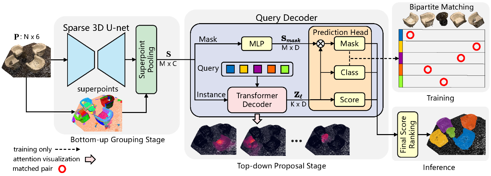
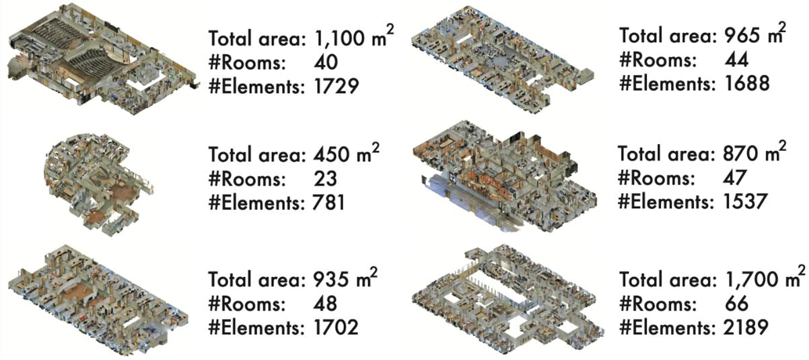

# 🎈 Superpoint transformer 3D Scene Segmentation

3D scene segmentation is a key area in computer vision and artificial intelligence. It enables the identification and classification of various objects within a three-dimensional scene, which is essential for applications such as robotics and urban mapping. However, the challenge lies in the increasing complexity of scenes and the diversity of objects, making it difficult to achieve high-performance segmentation.

In our project, we explored the effectiveness of the innovative model, SuperPoint Transformer, which stands as a state-of-the-art (SOTA) model in the field of 3D scene segmentation. With its attention mechanisms, this model improves the accuracy and efficiency of segmentation, offering new possibilities for real-time applications.

  

This is a local implementation of the Superpoint Transformer model in windows 11 using a conda environment and streamlit. The application can read a ply file, and generate a 3D Segmenetation of the scene provided. 

It has been trained on S3DIS and has 13 classes.

  

If you like to the work, make sure to leave a ⭐! 

## Setup

Make sure to install the pip dependencies presented in requirements.txt, as well as follow the original Superpoint Model repository for the full model setup. https://github.com/drprojects/superpoint_transformer

For windows installation, I manually picked and installed the dependencies needed (pip libraries and git repos). Make sure the python torch and cuda versions are correct and compatible before running. (python==3.8.19, torch==2.2.0+cu121, cuda_version=v12.5)

